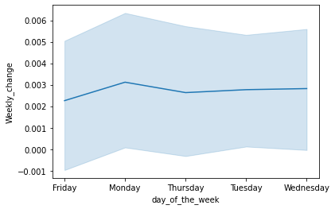
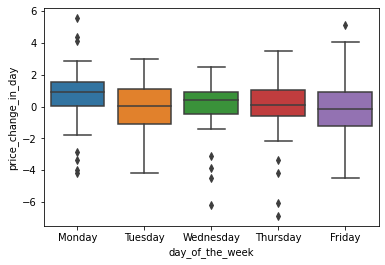
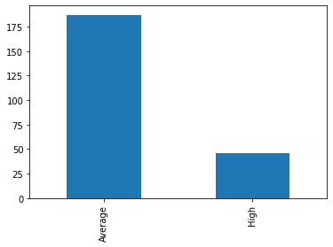
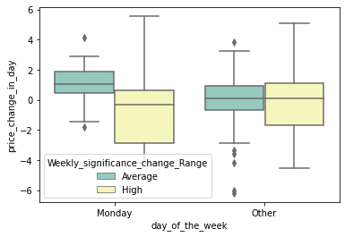

# Monday-Effect

The Monday effect is a theory which states that returns on the stock market on Mondays will follow the prevailing trend from the previous Friday. Therefore, if the market was up on Friday, it should continue through the weekend and, come Monday, resume its rise and vice versa. The Monday effect is also known as the "weekend effect."

## Theroy

Two-way ANOVA is to understand if there is an interaction between the two independent variables on the dependent variable. 

ANOVA tests for significance using the F-test for statistical significance. The F-test is a groupwise comparison test, which means it compares the variance in each group mean to the overall variance in the dependent variable.

P score : The P-value approach involves determining "likely" or "unlikely" by determining the probability — assuming the null hypothesis were true — of observing a more extreme test statistic in the direction of the alternative hypothesis than the one observed.

Z score: (also called a standard score) gives you an idea of how far from the mean a data point is. But more technically it’s a measure of how many standard deviations below or above the population mean a raw score

Tukey anova : Tukey 's multiple comparison test is one of several tests that can be used to determine which means amongst a set of means differ from the rest. Tukey's multiple comparison test is also called Tukey's honestly signi®cant difference test or Tukey's HSD

## Data
Apple stock data from Jan 2020 --- Dec 2020 

Features: Date,Open	,High,Low,Close,Adj,Close and Volume

```
Date	Open		High	Low			Close		Adj 		Close		Volume
0	2019-12-06	66.870003	67.750000	66.824997	67.677498	66.553131	106075600
1	2019-12-09	67.500000	67.699997	66.227501	66.730003	65.621384	128042400
```

## Data Explore

Weekday price change change 

```
df['price_change_in_day'] = df['Close'] - df['Open']
df['day_of_the_week'] = df['Date'].dt.day_name()
```




## Data Modification

Weekly Price change is calculated by computing the rolling difference between Closing and Opening price for a week. 

Split the weekly change on its deviation from mean using standard deviation 
```
df['Weekly_change'] =  df['Close'] - df['Open'].rolling(window=5,min_periods=0).mean() 

df['Weekly_significance_change'] =  abs(df['Weekly_change'] - df['Weekly_change'].mean())/df['Weekly_change'].std()

```

'Average' standard deviation indicates that the values tend to be close to the mean (also called the expected value) of the set, while a 'High' standard deviation indicates that the values are spread out over a wider range.

```

Weekly_Change = ['Average',  'High'  ]

bins= [0,1,2]

df['Weekly_significance_change_Range'] = pd.cut(df['Weekly_significance_change'], bins, labels=Weekly_Change)

```




## Anova

The monday effect is difference	in price change in monday compared to other days. So we will club the all other days [Tue,wed,Thur,Fri] as 'other'. I will use the two-way anova with tukey.

```
	group1			group2				Diff		Lower		Upper		q-value		p-value
0	(Monday, High)	(Monday, Average)	0.886508	-0.095614	1.868631	3.303818	0.092854
1	(Monday, High)	(Other, High)	    0.597785	-0.375504	1.571075	2.248031	0.387659
2	(Monday, High)	(Other, Average)	1.075192	0.217165	1.933220	4.586527	0.007380
3	(Monday, Average) 	(Other, High)	0.288723	-0.454714	1.032159	1.421464	0.721540
4	(Monday, Average)(Other, Average)	0.188684	-0.395796	0.773164	1.181585	0.816521
5	(Other, High)	(Other, Average)	0.477407	-0.092106	1.046920	3.068204	0.134779
```

## Conclusion
The result show the p-value for  (Monday, High)  (Other, Average) and (Monday, Average)(Other, Average) have significant difference. i.e 0.007380 and 0.816521

There are some monday which does not have significant change while this is true but for other week days but with monday's 'High' compared to that the others weekday 'average' changes there is significant difference. 